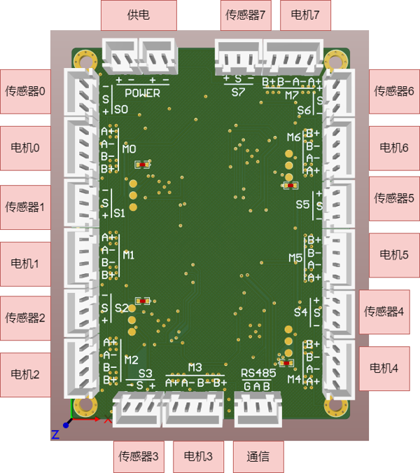
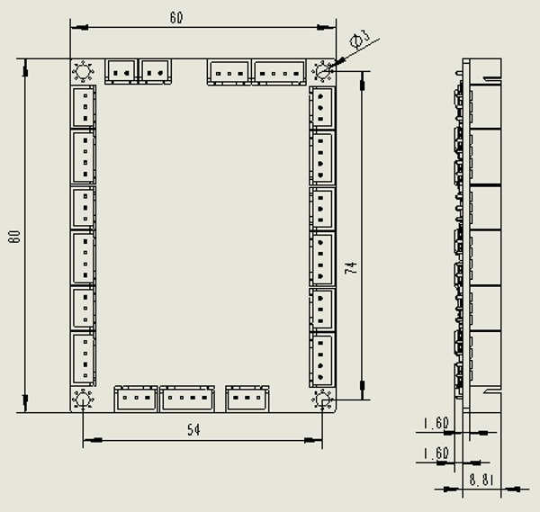

# BeeH
⭐ 欢迎使用BeeH系列电机控制器 - DBD团队最新研发的高性能8轴步进电机控制解决方案

## 接口介绍

## 尺寸信息

### 2D模型
[BeeH.dxf](images/BeeH.DXF)
### 3D模型
[BeeH.step](downloads/BeeH.step)

## 参数信息
| 参数 | 值 |
| ---- | ---- |
| 供电电压 | 24V |
| 供电电流 | >3A |
| 通信 | RS485 |
| 波特率 | 250Kbps |
| 适配电机 | 42及以下小功率4线2相步进电机 |
| 电机通道 | 8路 |
| 回零传感器通道 | 8路 |

## 上位机软件
[BeeD Tuner](downloads/BeeD.zip)

## 通信协议
[下载链接](downloads/BeeD通信协议V050114.xls)

## About DBD
DBD is a startup manufacturer of innovative matrix motion technologies, and as a manufacturer and developer of motor drives, controllers, and systems, DBD is designing its technology with emphasis on performance, efficiency, reliability, safety and simplicity.

## Technical Support
- If any questions, please feel free to contact us:
- 如果有任何问题, 请联系我们:

